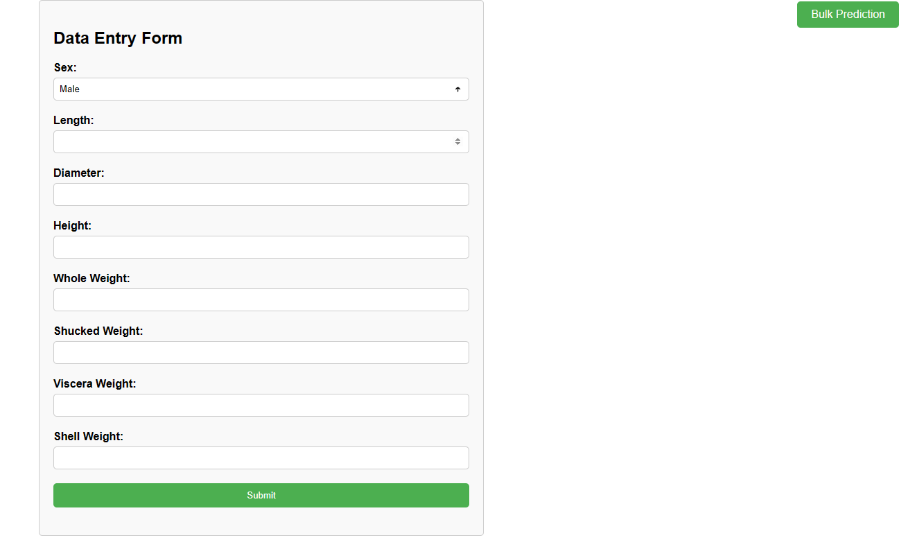
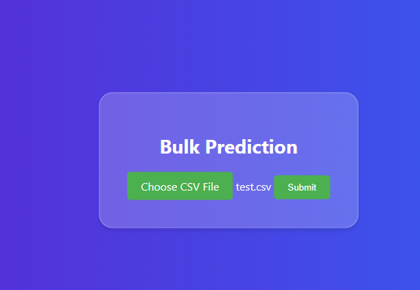
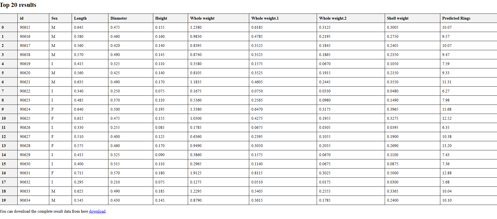

# Abalone_age_prediction

This project utilizes machine learning techniques to predict the number of rings in abalone shells based on input feature data. The workflow is divided into separate pipelines for data injection, transformation, model training, and evaluation. The XGBoost model is employed for prediction, with MLFlow used for experiment tracking and DVC for data versioning.

Features
Data Injection: Raw data is ingested and prepared for modeling.
Data Transformation: Processed data is transformed and preprocessed for training.
Model Training: XGBoost model is trained on the transformed data.
Model Evaluation: The trained model is evaluated using appropriate metrics.
Experiment Tracking: MLFlow is used to track experiments and model performance.
Data Versioning: DVC is employed for data versioning to maintain reproducibility.
Frontend Interface: A Flask-based frontend allows users to input features and predict abalone rings count.
Bulk Prediction: Users can upload a CSV file for bulk prediction, and download the result file with predicted abalone rings count.
Usage
To run the project:

Clone the repository to your local machine.
Install the required dependencies listed in requirements.txt.
Execute DVC:
bash : dvc init
bash : dvc repro

run the flask app file
bash : python app.py

Contributors
Muhammed Junais

MLFLOW_TRACKING_URI=https://dagshub.com/junaisk456/Abalone_age_prediction.mlflow \
MLFLOW_TRACKING_USERNAME=junaisk456 \
MLFLOW_TRACKING_PASSWORD=a4dcf1ebabde463c427fa51ac0272a6b4b0341e6 \
python script.py